# Arquitetura Técnica - Universal Asset Studio

## 1. Arquitetura de Sistema


## 2. Descrição das Tecnologias

- **Frontend**: React@18 + TypeScript + Vite
- **Core**: Genesis Plus GX (compilado via Emscripten)
- **Runtime**: WebAssembly + JavaScript
- **Styling**: CSS Modules + Tailwind CSS
- **Build**: Vite + Docker

## 3. Definições de Rotas

| Rota | Propósito |
|------|----------|
| / | Página inicial com seleção de ROM |
| /editor | Editor principal de assets |
| /sprites | Galeria de sprites decodificados |
| /palettes | Editor de paletas de cores |
| /tiles | Visualizador de tiles |
| /memory | Visualizador de memória bruta |
| /export | Interface de exportação de assets |

## 4. APIs do Core (Funções Exportadas)

### 4.1 APIs de Acesso à Memória

**Obter ponteiro da Work RAM**
```c
EMSCRIPTEN_KEEPALIVE uint8_t* _get_work_ram_ptr()
```

Parâmetros: Nenhum

Retorno:
| Tipo | Descrição |
|------|----------|
| uint8_t* | Ponteiro para Work RAM (64KB no Mega Drive) |

**Obter tamanho da Work RAM**
```c
EMSCRIPTEN_KEEPALIVE uint32_t _get_work_ram_size()
```

Parâmetros: Nenhum

Retorno:
| Tipo | Descrição |
|------|----------|
| uint32_t | Tamanho da Work RAM em bytes |

**Obter ponteiro da VRAM**
```c
EMSCRIPTEN_KEEPALIVE uint8_t* _get_vram_ptr()
```

Parâmetros: Nenhum

Retorno:
| Tipo | Descrição |
|------|----------|
| uint8_t* | Ponteiro para Video RAM (64KB no Mega Drive) |

**Obter ponteiro da CRAM**
```c
EMSCRIPTEN_KEEPALIVE uint8_t* _get_cram_ptr()
```

Parâmetros: Nenhum

Retorno:
| Tipo | Descrição |
|------|----------|
| uint8_t* | Ponteiro para Color RAM (128 bytes no Mega Drive) |

**Obter ponteiro da VSRAM**
```c
EMSCRIPTEN_KEEPALIVE uint8_t* _get_vsram_ptr()
```

Parâmetros: Nenhum

Retorno:
| Tipo | Descrição |
|------|----------|
| uint8_t* | Ponteiro para Vertical Scroll RAM (128 bytes) |

**Obter ponteiro da SAT**
```c
EMSCRIPTEN_KEEPALIVE uint8_t* _get_sat_ptr()
```

Parâmetros: Nenhum

Retorno:
| Tipo | Descrição |
|------|----------|
| uint8_t* | Ponteiro para Sprite Attribute Table |

**Obter referência do framebuffer**
```c
EMSCRIPTEN_KEEPALIVE uint8_t* _get_frame_buffer_ref()
```

Parâmetros: Nenhum

Retorno:
| Tipo | Descrição |
|------|----------|
| uint8_t* | Ponteiro para framebuffer de vídeo |

### 4.2 APIs de Status do Sistema

**Verificar inicialização do core**
```c
EMSCRIPTEN_KEEPALIVE int _is_core_initialized()
```

Parâmetros: Nenhum

Retorno:
| Tipo | Descrição |
|------|----------|
| int | 1 se inicializado, 0 caso contrário |

**Obter código do sistema ativo**
```c
EMSCRIPTEN_KEEPALIVE int _get_active_system_code()
```

Parâmetros: Nenhum

Retorno:
| Tipo | Descrição |
|------|----------|
| int | Código do sistema (0=SMS, 1=GG, 2=MD, 3=SCD) |

**Obter tamanho total de memória**
```c
EMSCRIPTEN_KEEPALIVE uint32_t _get_total_memory_size()
```

Parâmetros: Nenhum

Retorno:
| Tipo | Descrição |
|------|----------|
| uint32_t | Tamanho total de memória alocada |

### 4.3 Exemplo de Uso JavaScript

```javascript
// Inicialização do core
const createCore = window.genesis_plus_gx;
const core = await createCore();

// Configurar funções de acesso
const getWorkRamPtr = core.cwrap('_get_work_ram_ptr', 'number', []);
const getWorkRamSize = core.cwrap('_get_work_ram_size', 'number', []);
const getVramPtr = core.cwrap('_get_vram_ptr', 'number', []);
const getCramPtr = core.cwrap('_get_cram_ptr', 'number', []);
const isInitialized = core.cwrap('_is_core_initialized', 'number', []);

// Verificar inicialização
if (isInitialized()) {
    // Acessar Work RAM
    const workRamPtr = getWorkRamPtr();
    const workRamSize = getWorkRamSize();
    const workRam = new Uint8Array(core.HEAPU8.buffer, workRamPtr, workRamSize);
    
    // Acessar VRAM
    const vramPtr = getVramPtr();
    const vram = new Uint8Array(core.HEAPU8.buffer, vramPtr, 0x10000);
    
    // Acessar CRAM
    const cramPtr = getCramPtr();
    const cram = new Uint8Array(core.HEAPU8.buffer, cramPtr, 0x80);
}
```

## 5. Arquitetura de Componentes React


## 6. Modelo de Dados

### 6.1 Definição do Modelo de Dados


### 6.2 Estruturas de Dados TypeScript

```typescript
// Configuração do sistema
interface SystemConfiguration {
  systemCode: number;
  name: string;
  type: 'megadrive' | 'sms' | 'gamegear' | 'segacd';
  memoryLayout: {
    workRam: { size: number; address: number };
    vram: { size: number; address: number };
    cram: { size: number; address: number };
    vsram?: { size: number; address: number };
    extraRam?: Record<string, { size: number; address: number }>;
  };
}

// Snapshot de memória
interface MemorySnapshot {
  timestamp: number;
  systemCode: number;
  workRam: Uint8Array;
  vram: Uint8Array;
  cram: Uint8Array;
  vsram?: Uint8Array;
  sat: Uint8Array;
  framebuffer: {
    data: Uint8Array;
    width: number;
    height: number;
    pitch: number;
  };
}

// Dados de sprite decodificado
interface DecodedSprite {
  id: number;
  position: { x: number; y: number };
  dimensions: { width: number; height: number };
  tileIndex: number;
  paletteIndex: number;
  attributes: {
    priority: boolean;
    hFlip: boolean;
    vFlip: boolean;
  };
  imageData: ImageData;
  rawData: Uint8Array;
}

// Paleta decodificada
interface DecodedPalette {
  paletteIndex: number;
  systemType: string;
  colors: Array<{
    index: number;
    r: number;
    g: number;
    b: number;
    hex: string;
  }>;
}

// Estado do core
interface CoreState {
  isInitialized: boolean;
  isLoaded: boolean;
  currentSystem: SystemConfiguration | null;
  memorySnapshot: MemorySnapshot | null;
  error: string | null;
}
```

## 7. Fluxo de Dados

### 7.1 Inicialização do Core

```mermaid
sequenceDiagram
    participant UI as React UI
    participant Hook as useGenesisCore
    participant Core as Genesis Plus GX
    participant Memory as Memory Access
    
    UI->>Hook: Inicializar core
    Hook->>Core: Carregar genesis_plus_gx.js
    Core->>Hook: Core instance criado
    Hook->>Core: Configurar cwrap functions
    Core->>Hook: Funções configuradas
    Hook->>Memory: Testar acesso à memória
    Memory->>Hook: Acesso confirmado
    Hook->>UI: Core inicializado
```



### 7.2 Captura de Memória

```mermaid
sequenceDiagram
    participant UI as React UI
    participant Hook as useGenesisCore
    participant Core as Genesis Plus GX
    participant Decoder as Decodificadores
    
    UI->>Hook: Solicitar snapshot
    Hook->>Core: Obter ponteiros de memória
    Core->>Hook: Ponteiros retornados
    Hook->>Core: Copiar dados de memória
    Core->>Hook: Dados copiados
    Hook->>Decoder: Decodificar assets
    Decoder->>Hook: Assets decodificados
    Hook->>UI: Snapshot completo
```



### 7.3 Decodificação de Assets


## 8. Configurações de Build

### 8.1 Configuração do Vite

```typescript
// vite.config.ts
import { defineConfig } from 'vite';
import react from '@vitejs/plugin-react';

export default defineConfig({
  plugins: [react()],
  server: {
    headers: {
      'Cross-Origin-Embedder-Policy': 'require-corp',
      'Cross-Origin-Opener-Policy': 'same-origin'
    }
  },
  optimizeDeps: {
    exclude: ['genesis_plus_gx']
  },
  build: {
    target: 'es2020',
    rollupOptions: {
      external: ['genesis_plus_gx']
    }
  }
});
```

### 8.2 Configuração do Docker

```dockerfile
# Dockerfile para build do core
FROM emscripten/emsdk:3.1.45

WORKDIR /src

# Copiar arquivos de configuração
COPY docker/emscripten_exports_corrected.c .
COPY docker/compile-genesis.sh .

# Executar build
RUN chmod +x compile-genesis.sh && ./compile-genesis.sh

# Copiar artefatos
COPY genesis_plus_gx.js /output/
COPY genesis_plus_gx.wasm /output/
```

## 9. Considerações de Performance

### 9.1 Otimizações de Memória

- **Lazy Loading**: Carregar sprites apenas quando necessário
- **Caching**: Cache de assets decodificados
- **Pooling**: Reutilização de objetos ImageData
- **Compression**: Compressão de dados de sprite

### 9.2 Otimizações de Renderização

- **Virtual Scrolling**: Para listas grandes de sprites
- **Canvas Offscreen**: Renderização em background
- **RequestAnimationFrame**: Sincronização com refresh rate
- **Web Workers**: Decodificação em threads separadas

## 10. Roadmap de Expansão

### 10.1 Fase Atual (Mega Drive)
- ✅ Core compilado e funcional
- ✅ Exportações de memória validadas
- 🔄 Interface React em desenvolvimento
- 🔄 Decodificadores básicos

### 10.2 Próximas Fases
- 📋 Master System support
- 📋 Game Gear support
- 📋 Sega CD support
- 📋 Editor avançado de sprites
- 📋 Exportação para formatos modernos
- 📋 Plugin system para extensões

### 10.3 Funcionalidades Futuras
- 📋 Importação de ROMs via drag & drop
- 📋 Comparação side-by-side de assets
- 📋 Animação de sprites
- 📋 Edição de paletas em tempo real
- 📋 Exportação para engines modernas (Unity, Godot)
- 📋 API REST para integração externa