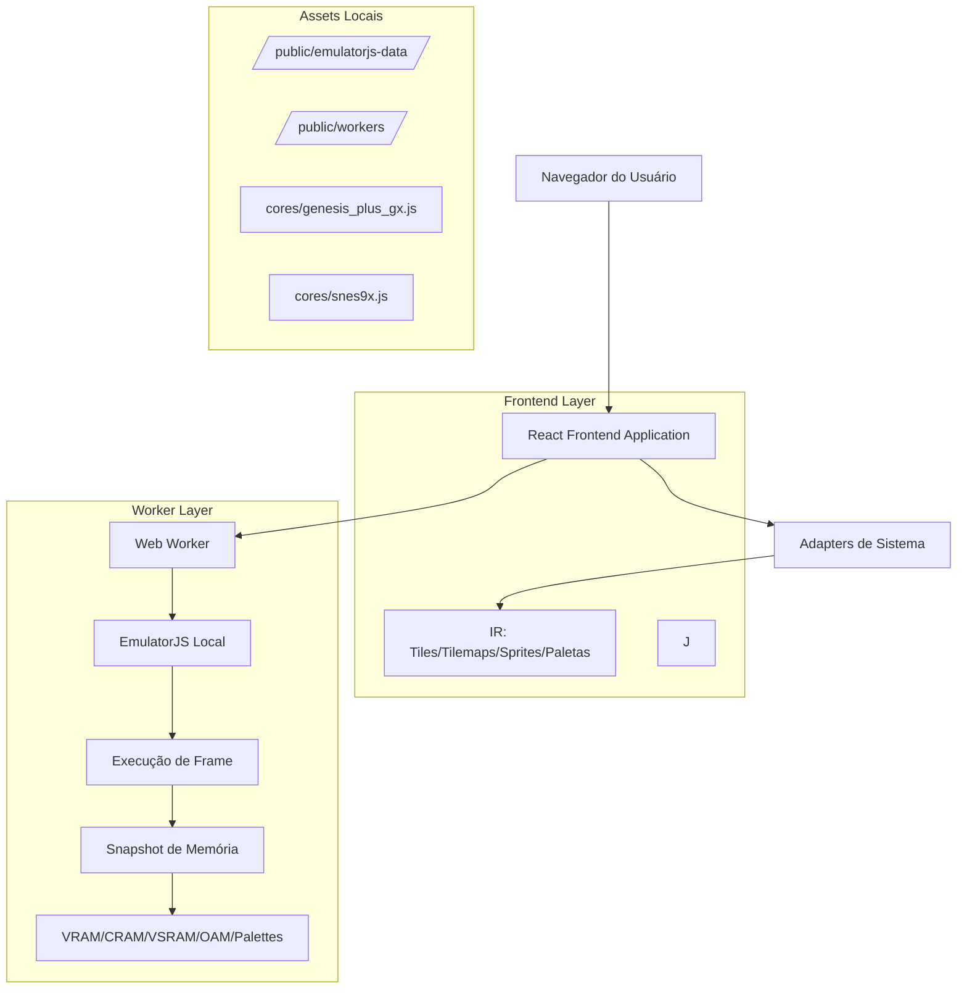
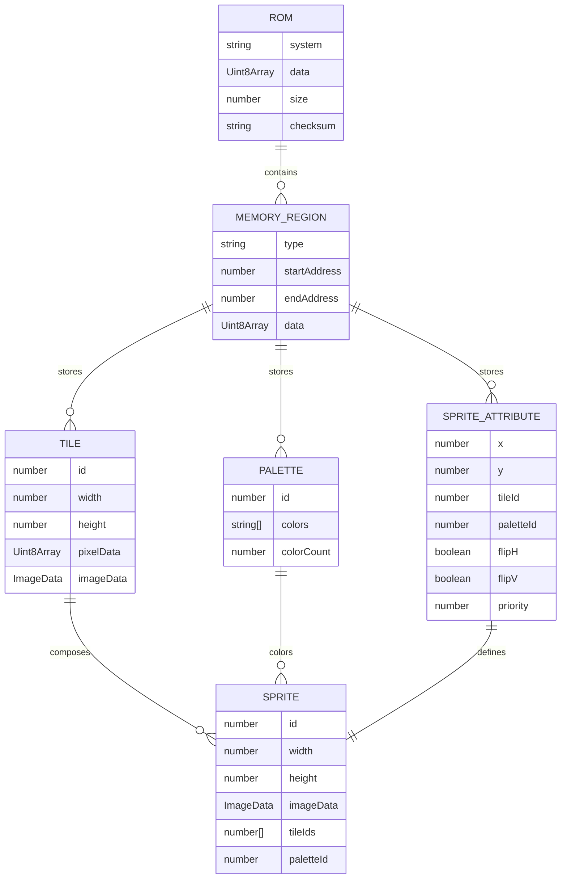

# Universal Asset Studio - Arquitetura Técnica

## 1. Design da Arquitetura



## 2. Descrição das Tecnologias

* **Frontend**: React@18 + TypeScript + Tailwind CSS + Vite

* **Worker**: Web Worker nativo com TypeScript

* **Emulação**: EmulatorJS@0.0.20 (totalmente local) com execução completa de ROM

* **Cores de Emulação**: Genesis Plus GX, SNES9x, Gambatte (executados no worker)

* **Extração de Dados**: Execução de pelo menos 1 frame antes da captura de memória

* **Build**: Vite com suporte a Web Workers

* **Styling**: Tailwind CSS + Lucide React Icons

## 3. Definições de Rotas

| Rota      | Propósito                                                   |
| --------- | ----------------------------------------------------------- |
| /         | Página principal com upload de ROM e seleção de sistema     |
| /editor   | Editor de sprites com galeria e ferramentas de visualização |
| /mapper   | Mapeador de cores com interface de 3 painéis                |
| /analyzer | Analisador de dados brutos e estruturas de memória          |
| /export   | Interface de exportação com múltiplos formatos              |

## 4. Definições de API (Comunicação Worker-UI)

### 4.1 API Principal do Worker

**Inicialização do Worker**

```typescript
// Mensagem para o Worker
interface WorkerMessage {
  type: 'LOAD_ROM' | 'EXTRACT_ASSETS' | 'GET_MEMORY_DATA';
  payload: {
    romData?: Uint8Array;
    system?: 'megadrive' | 'snes' | 'gameboy';
    memoryRegion?: 'vram' | 'cram' | 'sat';
  };
}

// Resposta do Worker
interface WorkerResponse {
  status: 'info' | 'error' | 'complete' | 'progress';
  message: string;
  step?: string; // [1/7], [2/7], etc.
  payload?: {
    vram?: Uint8Array;
    cram?: Uint8Array;
    sat?: Uint8Array;
    system: string;
  };
}
```

**Extração de Assets**

```
POST worker.postMessage()
```

Request:

| Nome do Parâmetro | Tipo       | Obrigatório | Descrição                                     |
| ----------------- | ---------- | ----------- | --------------------------------------------- |
| type              | string     | true        | Tipo da operação (LOAD\_ROM, EXTRACT\_ASSETS) |
| romData           | Uint8Array | true        | Dados binários do arquivo ROM                 |
| system            | string     | true        | Sistema de origem (megadrive, snes, gameboy)  |

Response:

| Nome do Parâmetro | Tipo   | Descrição                                            |
| ----------------- | ------ | ---------------------------------------------------- |
| status            | string | Status da operação (info, error, complete, progress) |
| message           | string | Mensagem descritiva do progresso                     |
| payload           | object | Dados extraídos (VRAM, CRAM, SAT)                    |

Exemplo:

```json
{
  "type": "LOAD_ROM",
  "payload": {
    "romData": "<Uint8Array>",
    "system": "megadrive"
  }
}
```

### 4.2 API dos Decodificadores

**Decodificação de Paletas**

```typescript
interface PaletteDecoder {
  static decode(cram: Uint8Array): string[][];
}
```

**Decodificação de Tiles**

```typescript
interface TileDecoder {
  static decodeAll(vram: Uint8Array, palette: string[]): ImageData[];
}
```

**Montagem de Sprites**

```typescript
interface SpriteAssembler {
  static assemble(sat: Uint8Array, tiles: ImageData[], palettes: string[][]): ImageData[];
}
```

## 5. Arquitetura do Servidor (N/A)

Esta aplicação é totalmente client-side, não requer servidor backend. Todos os processamentos são realizados no navegador através de Web Workers.

## 6. Modelo de Dados

### 6.1 Definição do Modelo de Dados



### 6.2 Estruturas de Dados TypeScript

**Tipos Base**

```typescript
// Estrutura principal do ROM processado
interface ProcessedROM {
  system: 'megadrive' | 'snes' | 'gameboy';
  memoryRegions: {
    vram: Uint8Array;
    cram: Uint8Array;
    sat: Uint8Array;
  };
  metadata: {
    size: number;
    checksum: string;
    title?: string;
  };
}

// Dados de tile decodificado
interface DecodedTile {
  id: number;
  width: number;
  height: number;
  pixelData: Uint8Array;
  imageData: ImageData;
}

// Paleta de cores
interface ColorPalette {
  id: number;
  colors: string[]; // Array de cores em formato #RRGGBB
  colorCount: number;
}

// Atributos de sprite
interface SpriteAttribute {
  x: number;
  y: number;
  tileId: number;
  paletteId: number;
  flipHorizontal: boolean;
  flipVertical: boolean;
  priority: number;
  size: 'small' | 'medium' | 'large' | 'xlarge';
}

// Sprite montado
interface AssembledSprite {
  id: number;
  width: number;
  height: number;
  imageData: ImageData;
  tileIds: number[];
  paletteId: number;
  attributes: SpriteAttribute;
}

// Estado da aplicação
interface AppState {
  currentROM: ProcessedROM | null;
  extractedSprites: AssembledSprite[];
  availablePalettes: ColorPalette[];
  selectedSprites: number[];
  currentPalette: ColorPalette | null;
  exportSettings: ExportSettings;
}

// Configurações de exportação
interface ExportSettings {
  format: 'sgdk' | 'c_array' | 'png' | 'json';
  compression: boolean;
  includeMetadata: boolean;
  namingConvention: 'snake_case' | 'camelCase' | 'PascalCase';
}
```

**Estruturas Específicas por Sistema**

```typescript
// Mega Drive específico
interface MegaDriveMemoryMap {
  vramStart: 0x0000;
  vramEnd: 0xFFFF;
  cramStart: 0x0000;
  cramEnd: 0x007F;
  satStart: 0x0000;
  satEnd: 0x027F;
}

// SNES específico (Fase 3)
interface SNESMemoryMap {
  vramStart: 0x0000;
  vramEnd: 0x7FFF;
  cgramStart: 0x0000;
  cgramEnd: 0x01FF;
  oamStart: 0x0000;
  oamEnd: 0x021F;
}

// Game Boy específico (Fase 3)
interface GameBoyMemoryMap {
  vramStart: 0x8000;
  vramEnd: 0x9FFF;
  bgPaletteStart: 0xFF68;
  spritePaletteStart: 0xFF6A;
  oamStart: 0xFE00;
  oamEnd: 0xFE9F;
}
```

**Configuração do Worker**

```typescript
// Configuração inicial do worker
interface WorkerConfig {
  emulatorPath: '/emulatorjs-data/';
  supportedSystems: ['megadrive', 'snes', 'gameboy'];
  maxROMSize: 8 * 1024 * 1024; // 8MB
  timeoutMs: 30000;
}

// Log de status do worker
interface WorkerLog {
  timestamp: number;
  level: 'info' | 'warn' | 'error';
  step: string;
  
```

