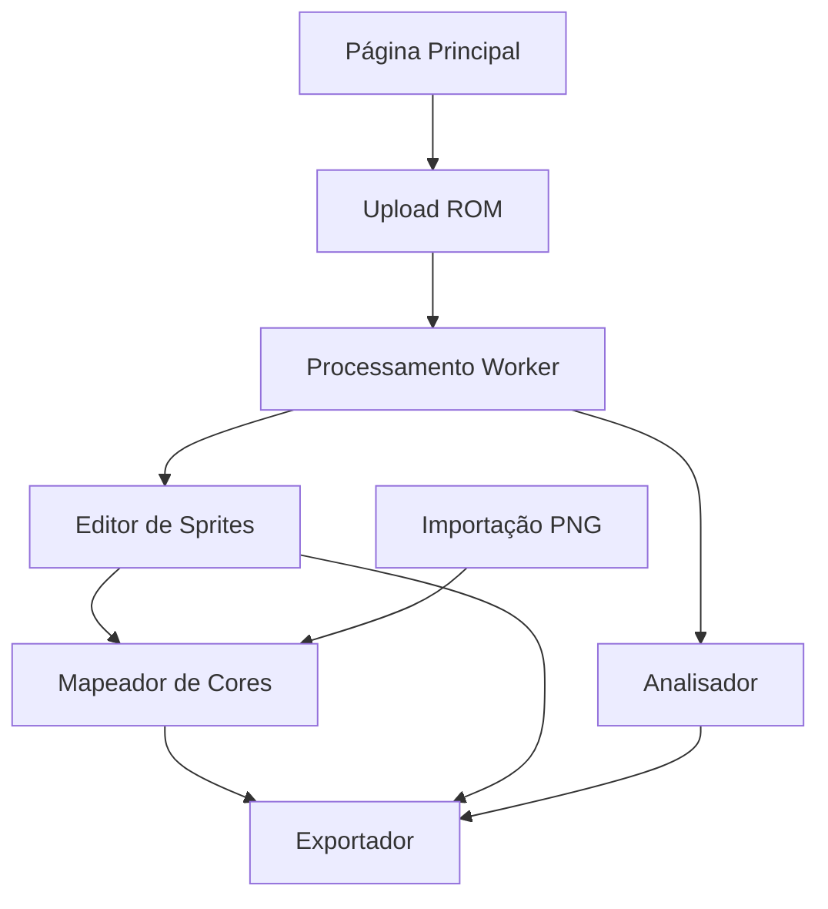

# Universal Asset Studio - Documento de Requisitos do Produto

## 1. Visão Geral do Produto

O Universal Asset Studio é uma aplicação web poderosa para extrair, editar e converter assets de jogos retrô através de **emulação completa**. A ferramenta permite que desenvolvedores e artistas trabalhem com sprites, paletas e tiles de sistemas clássicos como Sega Genesis/Mega Drive, SNES, Game Boy e outros, oferecendo funcionalidades avançadas de edição e conversão para formatos modernos de desenvolvimento.

**DIFERENCIAL TÉCNICO**: Ao contrário de ferramentas que tentam extrair dados estáticos da ROM, o Universal Asset Studio executa a ROM completamente em um emulador real, capturando os sprites conforme são gerados dinamicamente durante a execução do jogo. Isso garante acesso aos sprites reais, incluindo animações, estados de jogo e dados que só existem na memória durante a execução.

O produto resolve o problema da extração manual e trabalhosa de assets de ROMs de jogos retrô, oferecendo uma interface intuitiva para visualização, edição e exportação desses recursos para uso em projetos homebrew e remasters.

## 2. Funcionalidades Principais

### 2.1 Papéis de Usuário

| Papel | Método de Acesso | Permissões Principais |
|-------|------------------|----------------------|
| Desenvolvedor | Acesso direto via web | Pode extrair, visualizar, editar e exportar assets para código |
| Artista Digital | Acesso direto via web | Pode visualizar, editar paletas, remapear cores e exportar imagens |
| Pesquisador de Jogos | Acesso direto via web | Pode analisar estruturas de dados e extrair informações técnicas |

### 2.2 Módulos de Funcionalidade

Nossos requisitos consistem nas seguintes páginas principais:

1. **Página Principal**: interface de upload de ROM, seletor de sistema, painel de log de status
2. **Editor de Sprites**: galeria de sprites extraídos, ferramentas de visualização e seleção
3. **Mapeador de Cores**: interface de 3 painéis para remapeamento de paletas, pré-visualização em tempo real
4. **Analisador**: visualização de dados brutos, estruturas de memória e informações técnicas
5. **Exportador**: opções de formato de saída, configurações de conversão

### 2.3 Detalhes das Páginas

| Nome da Página | Nome do Módulo | Descrição da Funcionalidade |
|----------------|----------------|-----------------------------|
| Página Principal | Interface de Upload | Carregar arquivo ROM, selecionar sistema de origem, iniciar processamento |
| Página Principal | Painel de Log | Exibir mensagens de status do worker, progresso de processamento, erros |
| Página Principal | Seletor de Sistema | Escolher entre Mega Drive, SNES, Game Boy e outros sistemas suportados |
| Editor de Sprites | Galeria de Sprites | Visualizar todos os sprites extraídos em grade, zoom, seleção múltipla |
| Editor de Sprites | Ferramentas de Visualização | Controles de zoom, filtros, ordenação por tamanho/paleta |
| Mapeador de Cores | Painel Cores Extraídas | Exibir todas as cores únicas encontradas nos sprites |
| Mapeador de Cores | Painel Paleta Mestra | 16 slots para definir paleta alvo via drag-and-drop |
| Mapeador de Cores | Painel Pré-visualização | Mostrar sprites com nova paleta aplicada em tempo real |
| Mapeador de Cores | Importação PNG | Upload de imagem externa, redução automática de paleta |
| Analisador | Visualizador de Memória | Exibir dados brutos de VRAM, CRAM, SAT em formato hexadecimal |
| Analisador | Estruturas de Dados | Mostrar organização de tiles, paletas e sprites na memória |
| Exportador | Formatos de Saída | Exportar para SGDK .res, arrays C, PNG, JSON de metadados |
| Exportador | Configurações | Opções de compressão, formato de dados, nomenclatura de arquivos |

## 3. Requisitos Funcionais

### RF001 - Carregamento de ROM
- Sistema deve aceitar arquivos ROM de múltiplos formatos (.bin, .smd, .gen, .md)
- Detecção automática do tipo de console baseada em headers e assinaturas
- Validação de integridade do arquivo ROM
- Suporte a ROMs compactadas (.zip, .7z)

### RF001.1 - **NOVO: Emulação Completa da ROM**
- **CRÍTICO**: Sistema deve carregar e executar a ROM em emulador real
- Execução obrigatória de pelo menos 1 frame antes da extração
- Suporte a cores de emulação específicos:
  - **Mega Drive/Genesis**: Genesis Plus GX (genplus.js/wasm)
  - **SNES**: SNES9x (snes9x.js/wasm)
  - **Game Boy**: Gambatte (gambatte.js/wasm)
- Captura de estado completo da memória de vídeo após execução
- Extração de dados dinâmicos que só existem durante execução

### RF002 - Extração de Assets
- **ATUALIZADO**: Extração de sprites, tiles e paletas da **memória emulada**
- Decodificação de formatos gráficos específicos de cada console
- Identificação e catalogação de assets por tipo e localização
- Suporte a múltiplos bancos de memória gráfica
- **NOVO**: Captura de VRAM, CRAM, SAT e outros registros de vídeo

## 4. Processo Principal

### Fluxo do Desenvolvedor/Artista:
1. Usuário acessa a página principal e carrega um arquivo ROM
2. Sistema detecta automaticamente o tipo de console ou usuário seleciona manualmente
3. **NOVO**: Worker carrega core de emulação específico (Genesis Plus GX, SNES9x, etc.)
4. **NOVO**: Sistema inicializa ROM no emulador e executa pelo menos 1 frame
5. **NOVO**: Worker captura estado completo da memória de vídeo (VRAM, CRAM, SAT)
6. Worker processa dados extraídos da memória emulada, decodificando sprites reais
7. Usuário navega para Editor de Sprites para visualizar assets extraídos
8. Opcionalmente, usuário usa Mapeador de Cores para modificar paletas
9. Usuário exporta sprites finais nos formatos desejados
10. Para importação externa: usuário carrega PNG, mapeia cores, converte para tiles

### Fluxo do Pesquisador:
1. Usuário carrega ROM e processa dados
2. Navega para Analisador para examinar estruturas de memória
3. Visualiza dados brutos e organização técnica
4. Exporta informações técnicas para documentação

## 4. Design da Interface do Usuário

### 4.1 Estilo de Design

- **Cores Primárias**: #2563eb (azul principal), #1e40af (azul escuro)
- **Cores Secundárias**: #64748b (cinza), #f1f5f9 (cinza claro), #ef4444 (vermelho para erros)
- **Estilo de Botões**: Arredondados com bordas suaves, efeitos hover sutis
- **Fonte**: Inter ou system-ui, tamanhos 14px (corpo), 16px (títulos), 12px (labels)
- **Layout**: Design baseado em cards com navegação por abas, sidebar para ferramentas
- **Ícones**: Lucide React icons, estilo minimalista e consistente

### 4.2 Visão Geral do Design das Páginas

| Nome da Página | Nome do Módulo | Elementos da UI |
|----------------|----------------|----------------|
| Página Principal | Interface Upload | Card central com área de drag-drop, botão "Selecionar ROM", dropdown sistema |
| Página Principal | Painel Log | Console fixo na parte inferior, texto monoespaçado, cores por tipo de mensagem |
| Editor de Sprites | Galeria | Grid responsivo, cards 128x128px, overlay com informações, zoom modal |
| Mapeador de Cores | Três Painéis | Layout horizontal 1:1:1, cores como círculos 32x32px, drag visual feedback |
| Analisador | Visualizador Hex | Tabela monoespaçada, highlight de seleções, sidebar com offsets |
| Exportador | Opções | Formulário com checkboxes, radio buttons, preview do código gerado |

### 4.3 Responsividade

A aplicação é desktop-first com adaptação para tablets. Em telas menores que 1024px, os painéis do Mapeador de Cores se reorganizam verticalmente. Touch interactions são otimizadas para drag-and-drop em dispositivos móveis, com feedback visual aprimorado e áreas de toque maiores.